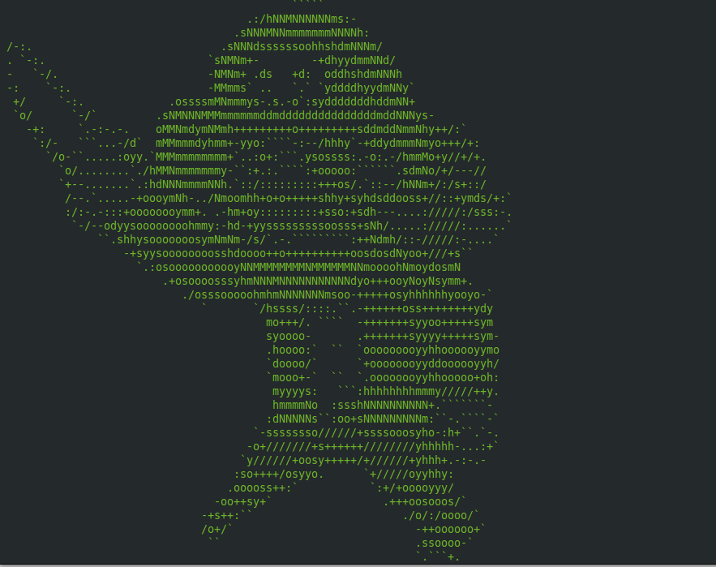

# pirate-virus

[](https://nodei.co/npm/pirate-virus/)

A pirate virus terminal app, like the one [from Archer without audio](https://www.youtube.com/watch?v=dzzqFFKwOik). Built this with [terminal-kit](https://github.com/cronvel/terminal-kit).


## Installation

```
npm install -g pirate-virus

```

## Running

If you install it globally "pv" will be on your path.

```
# just run forever
pv

# only run for 5 seconds
pv -s 5

```

Something like this will happen:


